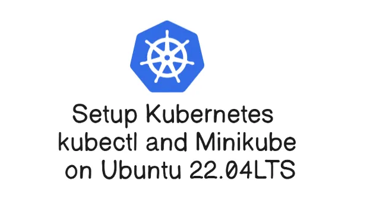

 

[](https://pypi.org/project/python-telegram-bot/)
[](https://pypi.org/project/python-telegram-bot/)
[](https://core.telegram.org/bots/api-changelog)
[](https://pypistats.org/packages/python-telegram-bot)
[](https://docs.python-telegram-bot.org/en/stable/)
[](https://www.gnu.org/licenses/lgpl-3.0.html)
[](https://github.com/python-telegram-bot/python-telegram-bot/)
[](https://app.codecov.io/gh/python-telegram-bot/python-telegram-bot)
[](https://isitmaintained.com/project/python-telegram-bot/python-telegram-bot)
[](https://app.codacy.com/gh/python-telegram-bot/python-telegram-bot/dashboard)
[](https://app.deepsource.com/gh/python-telegram-bot/python-telegram-bot/?ref=repository-badge)
[](https://results.pre-commit.ci/latest/github/python-telegram-bot/python-telegram-bot/master)
[](https://github.com/psf/black)
[](https://t.me/pythontelegrambotchannel)
[](https://telegram.me/pythontelegrambotgroup)


# Setup Kubernetes kubectl and Minikube on Ubuntu 22.04 LTS

 

##### Sebelum menginstal perangkat lunak apa pun, Anda perlu memperbarui dan meningkatkan sistem yang Anda gunakan. Untuk melakukannya, jalankan perintah berikut:

```sh
sudo apt-get update -y
sudo apt-get upgrade -y
```

##### Pastikan juga untuk menginstal (atau memeriksa apakah Anda sudah memiliki) paket-paket yang diperlukan berikut ini:

```sh
sudo apt-get install curl
sudo apt-get install apt-transport-https
```

## Install Menggunakan `apt` repository

##### Sebelum Anda menginstal Docker Engine untuk pertama kalinya pada mesin baru, Anda perlu mengatur repositori Docker. Setelah itu, Anda dapat menginstal dan memperbarui Docker dari repositori tersebut.

### Setup Repository 

#### 1. Perbarui indeks paket apt dan instal paket-paket yang memungkinkan apt menggunakan repositori melalui HTTPS:

```sh
sudo apt-get update
sudo apt-get install ca-certificates curl gnupg
```


#### 2. Tambahkan kunci GPG resmi Docker:

```sh
sudo install -m 0755 -d /etc/apt/keyrings
curl -fsSL https://download.docker.com/linux/ubuntu/gpg | sudo gpg --dearmor -o /etc/apt/keyrings/docker.gpg
sudo chmod a+r /etc/apt/keyrings/docker.gpg
```

#### 3. Gunakan perintah berikut untuk mengatur repositori:

```sh
echo \
"deb [arch=$(dpkg --print-architecture) signed-by=/etc/apt/keyrings/docker.gpg] https://download.docker.com/linux/ubuntu \
$(. /etc/os-release && echo $VERSION_CODENAME) stable" | \
sudo tee /etc/apt/sources.list.d/docker.list > /dev/null
```

## Install Docker Engine

#### 1. Perbarui indeks paket apt:

```sh
sudo apt-get update
```

#### 2. Instal Docker Engine, containerd, dan Docker Compose:

```sh
sudo apt-get install docker-ce docker-ce-cli containerd.io docker-buildx-plugin docker-compose-plugin
```

#### 3. Verifikasi bahwa instalasi Docker Engine berhasil dengan menjalankan gambar hello-world:

```sh
sudo docker run hello-world
```


## Install Docker Engine

#### 1. Unduh binary Minikube terbaru menggunakan perintah wget:

```sh
wget https://storage.googleapis.com/minikube/releases/latest/minikube-linux-amd64 -P ~/
```

#### 2. Salin file yang diunduh dan simpan ke direktori /usr/local/bin/minikube:

```sh
sudo cp /home/admin-minikube/minikube-linux-amd64 /usr/local/bin
sudo install minikube-linux-amd64 /usr/local/bin/minikube
```


#### 3. Beri file tersebut izin eksekutif menggunakan perintah chmod:

```sh
sudo chmod 755 /usr/local/bin/minikube-linux-amd64
```

#### 4. Verifikasi bahwa Anda telah berhasil menginstal Minikube dengan memeriksa versi perangkat lunaknya:

```sh
minikube version
``` 


## Install kubectl

### Langkah 1: Unduh kubectl

##### - Unduh binary kubectl dengan curl:

```sh
sudo curl -LO "https://dl.k8s.io/release/$(curl -Ls https://dl.k8s.io/release/stable.txt)/bin/linux/amd64/kubectl"
```


##### Perintah ini akan mengunduh binary kubectl terbaru sesuai dengan versi stabil Kubernetes untuk arsitektur AMD64.

### Langkah 2: Instalasi kubectl

##### - Pindahkan binary kubectl ke direktori /usr/local/bin/ dan beri izin eksekutif:

```sh
sudo install -o root -g root -m 0755 kubectl /usr/local/bin/kubectl
```

##### Perintah ini akan mengunduh binary kubectl terbaru sesuai dengan versi stabil Kubernetes untuk arsitektur AMD64.

### Langkah 3: Verifikasi instalasi

##### - Verifikasi instalasi kubectl dengan memeriksa versi:

```sh
kubectl version
```


##### Perintah di atas akan menampilkan versi kubectl yang diinstal. Jika instalasi berhasil, Anda seharusnya melihat output yang mencantumkan versi kubectl yang telah diinstal.

## Starting Minikube with Docker Driver

#### Sekarang kita akan memulai sebuah cluster Minikube menggunakan driver Docker. Berikut langkah-langkahnya:

### Langkah 1: Tambahkan pengguna Anda ke grup 'docker':

##### Jalankan perintah berikut untuk menambahkan pengguna Anda ke grup 'docker':

```sh
sudo usermod -aG docker $USER 
```

### Langkah 2: Penerapan perubahan group:

##### Jalankan newgrp docker untuk menerapkan perubahan grup tanpa logout:

```sh
newgrp docker 
```

### Langkah 3: Mulai Minikube dengan Docker Driver:

```sh
minikube start --driver=docker
```
 

##### Perintah di atas akan memulai Minikube dengan menggunakan Docker sebagai driver untuk menjalankan node Kubernetes di dalam container Docker.
##### Pastikan Docker sudah terinstal dan berjalan di sistem Anda sebelum memulai Minikube.

### Langkah 2: Verifikasi Status Minikube:

```sh
minikube verison
```

##### Perintah ini akan memberikan informasi tentang status dan konfigurasi dari cluster Minikube yang sedang berjalan.

 