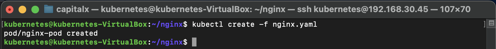
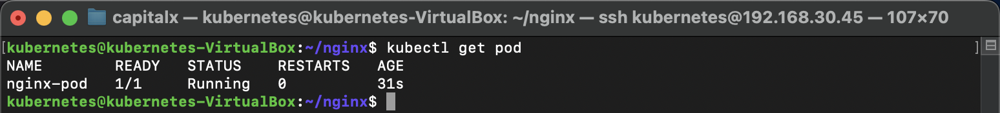
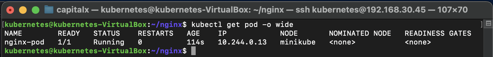
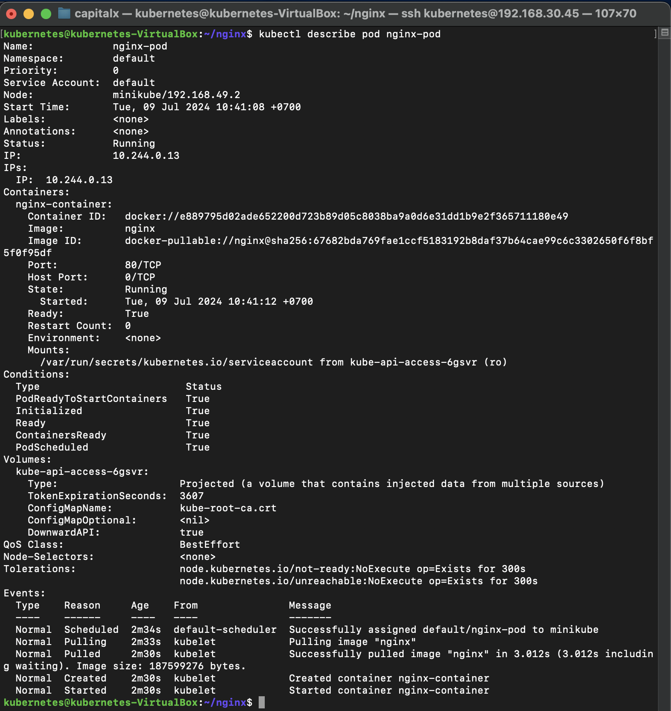
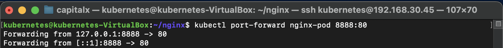
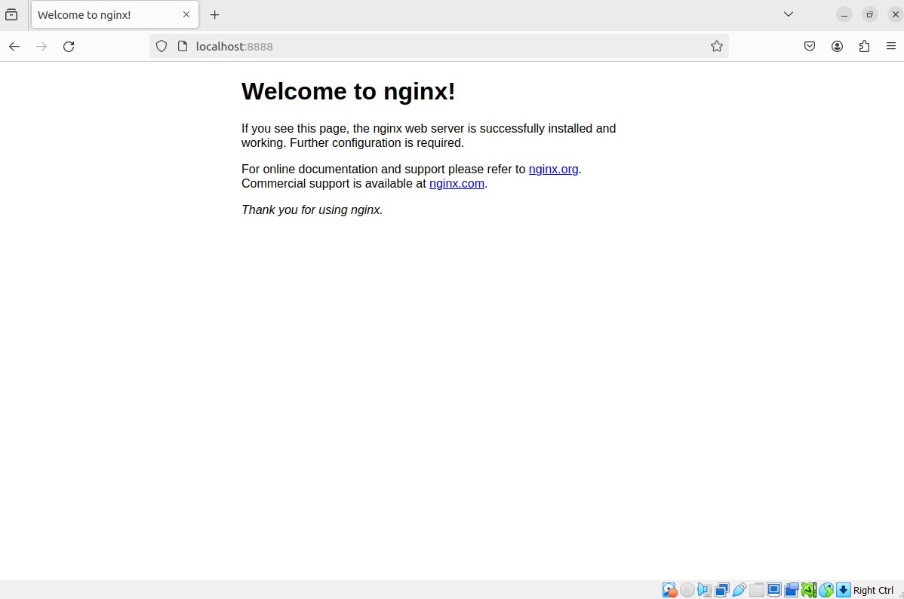

# Membuat Deployment dan Pod di Kubernetes dengan Minikube Menggunakan File YAML

##### Berikut adalah langkah-langkah untuk membuat dan mengakses sebuah Pod Nginx di Kubernetes menggunakan Minikube:

### Langkah 1: Persiapan File YAML:

##### Pertama, anda dapat membuat direktori kerja dan beralih ke direktori tersebut:

```sh
mkdir ~/nginx
cd ~/nginx
``` 

##### Kemudian, anda membuat file konfigurasi YAML untuk Pod Nginx:

```sh
nano nginx.yaml
``` 

##### Isi dari file nginx.yaml adalah sebagai berikut:

```sh
apiVersion: v1
kind: Pod
metadata:
  name: nginx-pod
spec:
  containers:
  - name: nginx-container
    image: nginx
    ports:
    - containerPort: 80
``` 

### Langkah 2: Membuat Pod dari File YAML

##### Selanjutnya, saya membuat Pod berdasarkan konfigurasi YAML yang telah dibuat:

```sh
kubectl create -f nginx.yaml
``` 



### Langkah 3: Mengecek Status Pod

##### Setelah Pod dibuat, saya mengecek statusnya untuk memastikan bahwa Pod sudah berjalan dengan baik:

```sh
kubectl get pod
``` 



##### Untuk melihat informasi lebih detail tentang Pod, saya menggunakan perintah berikut:

```sh
kubectl get pod -o wide
``` 

##### Hasilnya menunjukkan bahwa Pod sudah dalam status Running dan memberikan informasi IP serta node tempat Pod berjalan.



### Langkah 4: Deskripsi Pod

##### Saya juga bisa mendapatkan deskripsi lebih mendetail tentang Pod dengan perintah berikut:

```sh
kubectl describe pod nginx-pod
``` 



### Langkah 5: Port-Forwarding untuk Mengakses Pod:

##### Untuk mengakses Nginx yang berjalan di dalam Pod dari mesin lokal, saya menggunakan fitur port-forwarding:

```sh
kubectl port-forward nginx-pod 8888:80
``` 



##### Dengan perintah ini, saya bisa mengakses server Nginx yang berjalan di dalam Pod melalui URL `http://localhost:8888`.



##### Langkah-langkah di atas menunjukkan bagaimana membuat dan mengakses Pod di Kubernetes menggunakan Minikube. Ini adalah dasar yang baik untuk mulai mengelola aplikasi berbasis container di lingkungan orkestrasi Kubernetes.

##### #Kubernetes #Minikube #DevOps #ContainerOrchestration #Nginx #CloudComputing