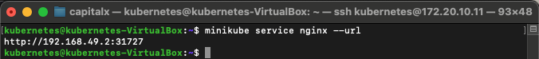
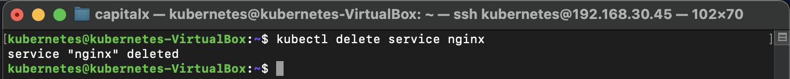
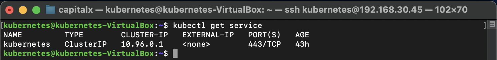
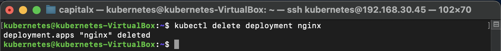
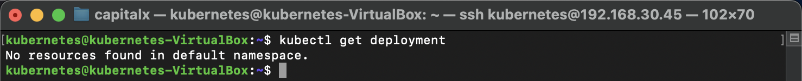

# Membuat Deployment dan Pod di Kubernetes dengan Minikube


### Langkah 1: Membuat Deployment

##### anda dapat membuat POD pada kubernetes menggunakan command dibawah ini 

```sh
kubectl create deployment nginx --image=nginx
``` 


##### Setelah deployment dibuat, saya mengecek status deployment tersebut:

```sh
kubectl get deployment
``` 


##### Hasilnya menunjukkan bahwa deployment sudah berhasil dibuat, tetapi pod masih dalam status ContainerCreating.

### Langkah 2: Mengecek Status Pod

##### Saya mengecek status pod yang baru saja dibuat menggunakan perintah:

```sh
kubectl get pod
``` 


### Langkah 3: Expose Deployment sebagai Service

##### Langkah berikutnya adalah mengekspos deployment sebagai sebuah service yang bisa diakses dari luar kluster Kubernetes:

```sh
kubectl expose deployment nginx --type=NodePort --port=80
``` 


##### Saya kemudian mengecek daftar service yang tersedia untuk memastikan service tersebut sudah terdaftar:

```sh
kubectl get services
```


### Langkah 4: Mengakses Service

##### Terakhir, saya menggunakan Minikube untuk mendapatkan URL yang bisa digunakan untuk mengakses service Nginx:

```sh
minikube service nginx --url
```



##### Hasilnya adalah URL yang bisa saya gunakan untuk mengakses server Nginx dari browser atau alat lain:

```sh
http://192.168.49.2:31727
```


### Langkah 5: Menghapus Service dan Deployment

##### Setelah selesai menguji, saya menghapus service dan deployment yang telah dibuat untuk menjaga lingkungan tetap bersih. Langkah pertama adalah menghapus service:

```sh
kubectl delete service nginx
```



##### Lalu, saya mengecek daftar service untuk memastikan service tersebut telah dihapus:

```sh
kubectl get service
```



##### Kemudian, saya menghapus deployment:

```sh
kubectl delete deployment nginx
```



##### Dan mengecek kembali daftar deployment untuk memastikan tidak ada resource yang tersisa:

```sh
kubectl get deployment
```




##### Demikian langkah-langkah untuk membuat, mengakses, dan menghapus deployment serta service di Kubernetes menggunakan Minikube. Ini adalah dasar yang baik untuk memulai eksplorasi lebih lanjut dalam dunia orkestrasi container. Saya harap ini bisa membantu teman-teman yang baru memulai dengan Kubernetes!

##### #Kubernetes #Minikube #DevOps #ContainerOrchestration #Nginx #CloudComputing