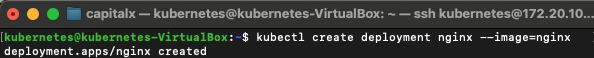
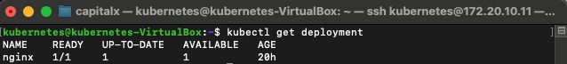
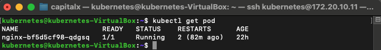
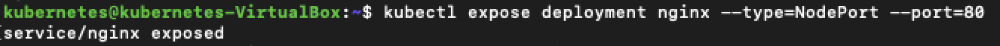
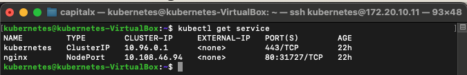
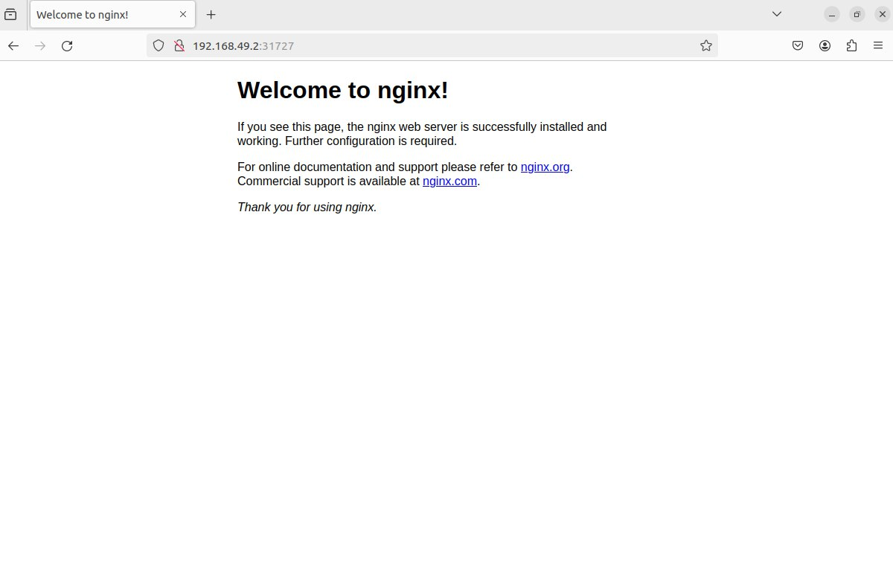

# Membuat Deployment dan Pod di Kubernetes dengan Minikube


### Langkah 1: Membuat Deployment

##### anda dapat membuat POD pada kubernetes menggunakan command dibawah ini 

```sh
kubectl create deployment nginx --image=nginx
``` 



##### Setelah deployment dibuat, saya mengecek status deployment tersebut:

```sh
kubectl get deployment
``` 



##### Hasilnya menunjukkan bahwa deployment sudah berhasil dibuat, tetapi pod masih dalam status ContainerCreating.

### Langkah 2: Mengecek Status Pod

##### Saya mengecek status pod yang baru saja dibuat menggunakan perintah:

```sh
kubectl get pod
``` 



### Langkah 3: Expose Deployment sebagai Service

##### Langkah berikutnya adalah mengekspos deployment sebagai sebuah service yang bisa diakses dari luar kluster Kubernetes:

```sh
kubectl expose deployment nginx --type=NodePort --port=80
``` 



##### Saya kemudian mengecek daftar service yang tersedia untuk memastikan service tersebut sudah terdaftar:

```sh
kubectl get services
```



### Langkah 4: Mengakses Service

##### Terakhir, saya menggunakan Minikube untuk mendapatkan URL yang bisa digunakan untuk mengakses service Nginx:

```sh
minikube service nginx --url
```

##### Hasilnya adalah URL yang bisa saya gunakan untuk mengakses server Nginx dari browser atau alat lain:

```sh
http://192.168.49.2:31727
```




